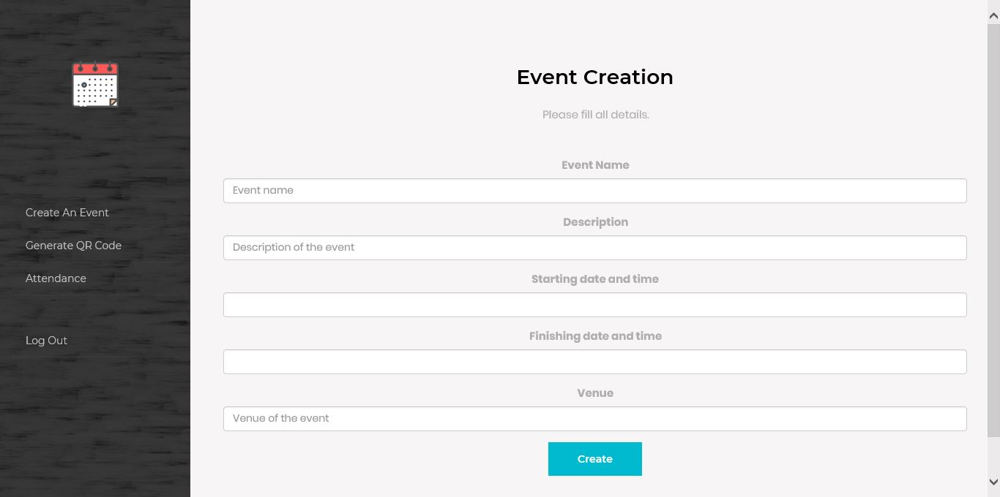

# Creating an event

In order to create an event, all fields in the form must be filled. After creating an event, the event creator has to wait for the event verifier to verify the event to handle an event. After verifying, the event creator will be able to generate a QR code used for attendance at the event.

