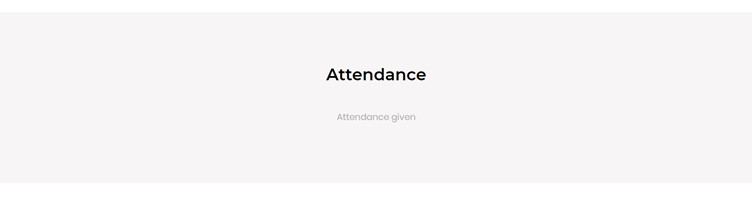

# Giving an attendance

Once the user scans a QR code to give attendance for the registered event, they will receive a message stating that the attendance is given. If the user hasn't registered for the event, the attendance won't be counted.

