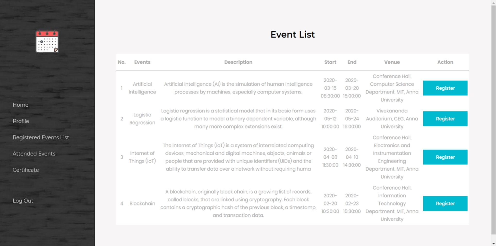
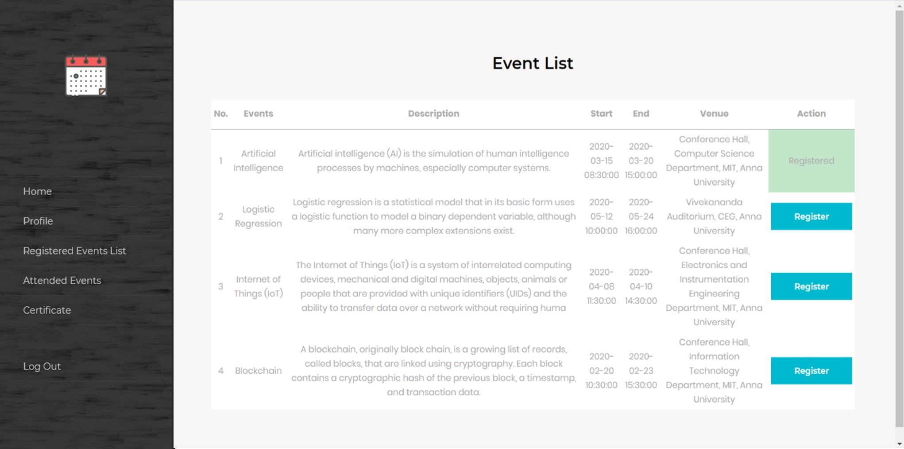

# Register an event

The register event page contains the list of events that are taking place with details of the events with the option to register for the event. When the register button is selected the user gets registered.

